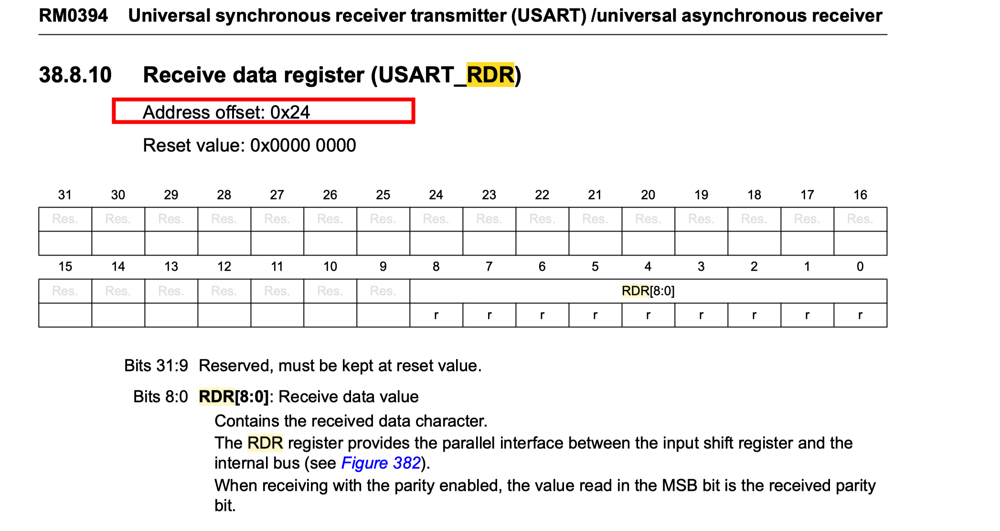
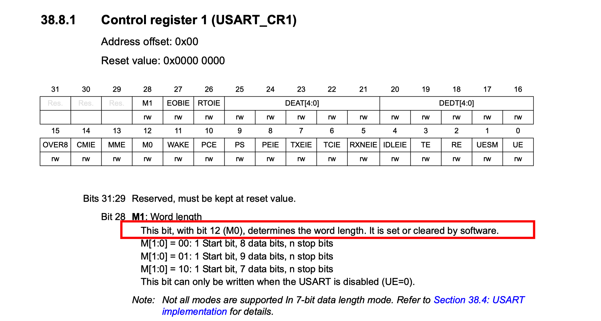
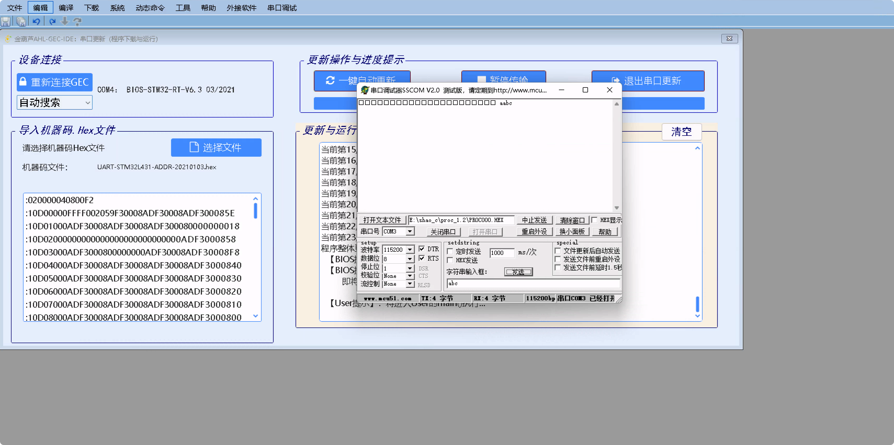
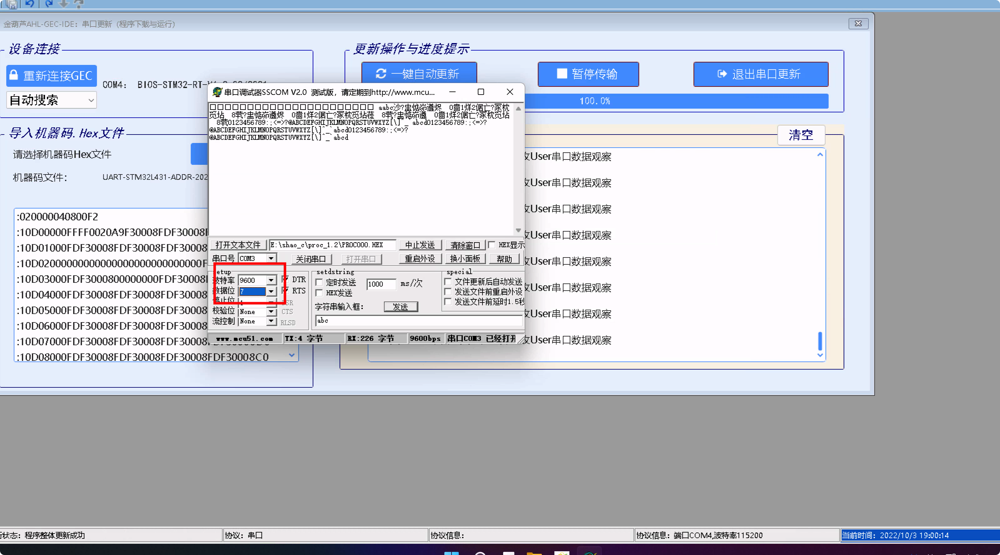

<div align='center' ><font size='70'>嵌入式学习札记</font></div>

[TOC]

# 第一次

## 基础知识与熟悉

略

## STM32L系列硬件

### 基本组成

LED三色灯，温度传感器，TTL-USB串口，触摸区，复位按钮。

### 硬件图

》，第 64 页.png)

## GPIO相关

### 概念

是输入与输出的接口，MCU通过GPIO与外界进行交互。

通常高电平（Vcc）对应数字信号1，低电平（GND）对应数字信号0。MCU使用端口寄存器来控制引脚输出1或0。MCU也可以通过端口寄存器来获取引脚的实际状态。

### 常用寄存器

|  寄存器名   | 功能  |
|  :----:  | :----:  |
|模式寄存器（GPIOx_MODER）|配置引脚功能模式 |
|输出数据寄存器（GPIOx_ODR）|读取输出引脚电平 |
|复位寄存器（GPIOx_BRR）|复位输出引脚电平 |
|置位/复位寄存器（GPIOx_BSRR）|置位/复位输出引脚 |
|...|...|

### 软件干预硬件

常用函数：gpio_init，gpio_set，gpio_get等等。

64 引脚封装的STM32L431芯片的GPIO引脚分为5 个端口，标记为A、B、C、D，以及H，共含50个引脚。端口作为GPIO引脚时，逻辑1对应高电平，逻辑0对应着低电平。

## 实验一

### GPIO端口模式寄存器（GPIOx_MODER）

这个寄存器用于配置GPIO端口相应引脚的工作模式。工作模式一共分四种，分别为输入模式，输出模式，复用功能模式，模拟模式。

因为一个口有16个引脚，该寄存器为32位，所以每两个二进制位控制一个引脚的状态，分别对应如下表，在这里注意：和一般的编程习惯一样，它序号是从0开始的：

| 数据位 | D31~D30     | D29~D28     | …    | D3~D2      | D1~D0      |
| ------ | ----------- | ----------- | ---- | ---------- | ---------- |
| 读/写   | MODE15[1:0] | MODE14[1:0] | …    | MODE1[1:0] | MODE0[1:0] | 

### GPIO端口输出数据寄存器（GPIOx_ODR）

这个寄存器用来设置GPIO端口的输出电平。1代表高电平，0代表低电平。D31~D16位保留，若OD5=0，5号引脚为低电平；OD5=1，5号引脚为高电平。

### GPIO端口位置1/复位寄存器（GPIOx_BSRR）

这个寄存器用来置1或者清0。这个寄存器有32个位，低16位的作用是让指定的IO口置1；而高16位的作用是让指定的IO口置0。

假如GPIO_A原本的状态是1111 0000 1111 0000 ，要想让第3位置1，就可以使GPIO->BSRR=0000 0000 0000 0000 0000 0000 0000 1000，那么此时GPIOA的状态就会变成1111 0000 1111 1000，也就是说，如果想让某个位置1，只需要在BSRR把对应的那个位写1就行了，写0的位不会发生改变。置0同理，只不过在BSRR的高16位操作。

### GPIO端口复位寄存器（GPIOx_BRR）

该寄存器用于复位GPIO端口相应引脚的输出状态为低电平。

功能与BSRR寄存器的高16位相同。

### 利用输出数据寄存器（GPIOx_ODR）来更换BSRR和BRR寄存器

首先我们要定义ODR寄存器：

```c
volatile uint32_t* gpio_odr;    //GPIO位复位寄存器
```

用B口ODR寄存器的绝对地址0x48000414减去B口基址0x48000400得到0x14，转换为十进制后得到20，因为4个字节一个单元，20/4得到偏移量为5。

```c
gpio_odr=gpio_ptr+5;
```

因为绿灯在B口8引脚处，根据GPIOx_MODER寄存器的工作范围来看，需要将该寄存器的16，17位变为01，就可以控制该引脚为低电平，绿灯闪烁。

控制某位为0可以用0与其做“与”运算，反之为1就用1与其做“或运算”。

所以编写如下代码即可：

```c
*gpio_mode &= ~(1<<17);  
*gpio_mode |=(1<<16);  
```

最后一步需要改变ODR寄存器的值来控制GPIO相应引脚的输出电平，因为绿灯在B口8引脚处，所以要控制8引脚为0输出低电平使灯亮，反之同理，类比上面的步骤编写代码：

```c
if (mFlag=='A')   //若灯状态标志为'A'
{
  *gpio_odr&=~(1<<8);     //设置灯“亮”
  printf("绿灯：亮\r\n");  //通过调试串口输出灯的状态
  mFlag='L';             //改变状态标志
}
else                   //否则,若灯状态标志不为'A'    
{
  *gpio_odr|=(1<<8);     //设置灯“暗”
  printf("绿灯：暗\r\n");   //通过调试串口输出灯的状态
  mFlag='A';              //改变状态标志
}	
```

### 最终代码

```c
#define GLOBLE_VAR
#include "includes.h"      //包含总头文件

//----------------------------------------------------------------------
//声明使用到的内部函数
//main.c使用的内部函数声明处

//----------------------------------------------------------------------
//主函数，一般情况下可以认为程序从此开始运行（实际上有启动过程见书稿）
int main(void)
{
  //（1）======启动部分（开头）==========================================
  //（1.1）声明main函数使用的局部变量
  uint32_t mMainLoopCount;  //主循环使用的记录主循环次数变量
  uint8_t  mFlag;            //主循环使用的临时变量

  //（1.2）【不变】关总中断
  DISABLE_INTERRUPTS;


  //（1.3）给主函数使用的局部变量赋初值
  mMainLoopCount = 0;     //主循环使用的记录主循环次数变量
  mFlag='A';              //主循环使用的临时变量：蓝灯状态标志
  volatile uint32_t* RCC_AHB2;    //GPIO的B口时钟使能寄存器地址
  volatile uint32_t* gpio_ptr;    //GPIO的B口基地址
  volatile uint32_t* gpio_mode;   //引脚模式寄存器地址=口基地址
  volatile uint32_t* gpio_bsrr;   //置位/复位寄存器地址
  volatile uint32_t* gpio_brr;    //GPIO位复位寄存器
  volatile uint32_t* gpio_odr;    //GPIO位复位寄存器
  //（1.5.2）变量赋值
  RCC_AHB2=(uint32_t*)0x4002104C;   //GPIO的B口时钟使能寄存器地址
  gpio_ptr=(uint32_t*)0x48000400;   //GPIO的B口基地址
  gpio_mode=gpio_ptr;    //引脚模式寄存器地址=口基地址
  //	gpio_mode=0b00000000000000000000000000000000;
  gpio_bsrr=gpio_ptr+6;  //置位/复位寄存器地址
  gpio_brr=gpio_ptr+10;  //GPIO位复位寄存器
  //  gpio_odr=(uint32_t*)0x48000414;
  gpio_odr=gpio_ptr+5;
  *RCC_AHB2|=(1<<1);       //GPIOB的B口时钟使能
  //（1.5.3.1）定义B口9脚为输出引脚（令D19、D18=01)方法如下：
  *gpio_mode &= ~(1<<17);  //0b11111111111100111111111111111111;
  *gpio_mode |=(1<<16);    //0b00000000000001000000000000000000;

  ENABLE_INTERRUPTS;

  for(;;)     //for(;;)（开头）
  {

    //（2.1）主循环次数+1，并判断是否小于特定常数
    mMainLoopCount++;                         //+1
    if (mMainLoopCount<=6556677)  continue;   //如果小于特定常数，继续循环
    //（2.2）主循环次数超过特定常数，灯状态进行切换（这样灯会闪烁）
    mMainLoopCount=0;      //清主循环次数
    //切换灯状态
    if (mFlag=='A')   //若灯状态标志为'A'
    {
      *gpio_odr&=~(1<<8);     //设置灯“亮”
      printf("绿灯：亮\r\n");  //通过调试串口输出灯的状态
      mFlag='L';             //改变状态标志
    }
    else                   //否则,若灯状态标志不为'A'    
    {
      *gpio_odr|=(1<<8);     //设置灯“暗”
      printf("绿灯：暗\r\n");   //通过调试串口输出灯的状态
      mFlag='A';              //改变状态标志
    }	
  }     //for(;;)结尾
  //（2）======主循环部分（结尾）========================================
}
```

### 实验截图


## 实验二

### GPIO常用函数

| 序号 | 函数名           | 简明功能        | 描述                                                         |
| ---- | ---------------- | --------------- | ------------------------------------------------------------ |
| 1    | gpio_init        | 初始化          | 引脚复用为GPIO功能；定义其为输入或输出；若为输 出，还给出其初始状态 |
| 2    | gpio_set         | 设定引脚状态    | 在GPIO输出情况下，设定引脚状态（高/低电平）                  |
| 3    | gpio_get         | 获取引脚状态    | 在GPIO输入情况下，获取引脚状态（1/0）                        |
| 4    | gpio_reverse     | 反转引脚状态    | 在GPIO输出情况下，反转引脚状态                               |
| 5    | gpio_pull        | 设置引脚上/下拉 | 当GPIO输入情况下，设置引脚上/下拉                            |
| 6    | gpio_enable_int  | 使能中断        | 当GPIO输入情况下，使能引脚中断                               |
| 7    | gpio_disable_int | 关闭中断        | 当GPIO输入情况下，关闭引脚中断                               |
### 使用gpio_reverse来替换gpio_set

那就首先跟进一下代码，看看gpio_set是怎么定义的：


是在gpio.c的第73行中：

```c
void gpio_set(uint16_t port_pin, uint8_t state)
{
	//局部变量声明
	GPIO_TypeDef *gpio_ptr;    //声明port_ptr为GPIO结构体类型指针（首地址）
	uint8_t port,pin;        //声明端口port、引脚pin变量
	//根据带入参数port_pin，解析出端口与引脚分别赋给port,pin
	gpio_get_port_pin(port_pin,&port,&pin);
	//根据port，给局部变量gpio_ptr赋值（GPIO基地址）
	if(7 == port) //GPIOH
		gpio_ptr = GPIO_ARR[port-2];
	else
		gpio_ptr = GPIO_ARR[port];

	//根据state，设置对应引脚状态
	if(1 == state)    //高电平(该引脚对应置位寄存器置1)
		gpio_ptr->BSRR = (uint32_t)(1u<<pin);
	else              //低电平(该引脚对应重置寄存器置1)
		gpio_ptr->BRR = (uint32_t)(1u<<pin);
}
```

可以看到该函数接受两个值，第一个引脚pin，第二个是引脚的状态。大意就是高电平（1）就把BSRR寄存器相应的位置1，反之亦然。

再看看gpio_reverse函数：

```c
void gpio_reverse(uint16_t port_pin)
{
	//局部变量声明
	GPIO_TypeDef *gpio_ptr;    //声明port_ptr为GPIO结构体类型指针（首地址）
	uint8_t port,pin;        //声明端口port、引脚pin变量
	//根据带入参数port_pin，解析出端口与引脚分别赋给port,pin
	gpio_get_port_pin(port_pin,&port,&pin);
	//根据port，给局部变量gpio_ptr赋值（GPIO基地址）
	if(7 == port) //GPIOH
		gpio_ptr = GPIO_ARR[port-2];
	else
		gpio_ptr = GPIO_ARR[port];

    //判断引脚输出状态
	if ((gpio_ptr->ODR & (1u<<pin)) != 0x00u)
		//高电平，则反转为低电平
		gpio_ptr->BRR = (uint32_t)(1u<<pin);
	else
		//低电平，则反转为高电平
		gpio_ptr->BSRR = (uint32_t)(1u<<pin);
}
```

可以看到就是使用ODR寄存器来判断电平状态，如果高电平，就反转。所以在这里其实使用gpio_set或者gpio_reverse并没有区别，因为gpio_reverse函数中就执行的set的操作。只要更改代码就行了。

### 最终代码

```c

int main(void)
{
//（1）======启动部分（开头）==========================================
//（1.1）声明main函数使用的局部变量
	uint32_t mMainLoopCount;  //主循环次数变量
	uint8_t  mFlag;           //灯的状态标志
	uint32_t mLightCount;     //灯的状态切换次数

//（1.2）【不变】关总中断
	DISABLE_INTERRUPTS;

//（1.3）给主函数使用的局部变量赋初值
    mMainLoopCount=0;    //主循环次数变量
	mFlag='A';           //灯的状态标志
	mLightCount=0;       //灯的闪烁次数

//（1.4）给全局变量赋初值
   
//（1.5）用户外设模块初始化
	gpio_init(LIGHT_BLUE,GPIO_OUTPUT,LIGHT_ON);	//初始化蓝灯
	


	ENABLE_INTERRUPTS;
	
	printf("------------------------------------------------------\n");   
    printf("金葫芦提示：构件法输出控制小灯亮暗   \n");
    printf("    第一次用构件方法点亮的蓝色发光二极管，\n");
    printf("    这是进行应用编程的第一步，可以在此基础上，\n");
    printf("   “照葫芦画瓢”地继续学习实践。\n");
    printf("    例如：改为绿灯；调整闪烁频率等。\n");
    printf("------------------------------------------------------\n"); 
    
    //asm ("bl .");
    
    //for(;;) {  }     //在此打桩，理解蓝色发光二极管为何亮起来了？
    
        
//（1）======启动部分（结尾）==========================================

//（2）======主循环部分（开头）========================================
	for(;;)   //for(;;)（开头）
	{
//（2.1）主循环次数变量+1
        mMainLoopCount++;
//（2.2）未达到主循环次数设定值，继续循环
		if (mMainLoopCount<=12888999)  continue;
//（2.3）达到主循环次数设定值，执行下列语句，进行灯的亮暗处理
//（2.3.1）清除循环次数变量
		mMainLoopCount=0; 
//（2.3.2）如灯状态标志mFlag为'L'，灯的闪烁次数+1并显示，改变灯状态及标志
		if (mFlag=='L')                    //判断灯的状态标志
		{
			mLightCount++;  
			printf("灯的闪烁次数 mLightCount = %d\n",mLightCount);
			mFlag='A';                       //灯的状态标志
            gpio_reverse(LIGHT_BLUE);
		//	gpio_set(LIGHT_BLUE,LIGHT_ON);  //灯“亮”
			printf(" LIGHT_BLUE:ON--\n");   //串口输出灯的状态
		}
//（2.3.3）如灯状态标志mFlag为'A'，改变灯状态及标志
		else
		{
			mFlag='L';                       //灯的状态标志
            gpio_reverse(LIGHT_BLUE);
	//		gpio_set(LIGHT_BLUE,LIGHT_OFF); //灯“暗”
			printf(" LIGHT_BLUE:OFF--\n");  //串口输出灯的状态
		}
	}  //for(;;)结尾
//（2）======主循环部分（结尾）========================================
}   //main函数（结尾）

```

### 实验截图


# 第二次

## 实验三

需要实现三色流水灯效果，所谓流水灯，就是指各种颜色按顺序亮一次即可。

### 实现三色灯流水灯效果

#### 构件法

可以先定义一个数组，里面存放三种灯的不同定义：

```c
uint16_t lights[3] = {(PTB_NUM|9),(PTB_NUM|8), (PTB_NUM|7)};
```

然后编写一个控制亮灯/灭灯的函数，循环遍历这个数组，对于数组中的每个不同颜色的灯进行函数调用即可：

```c
void light_control(uint16_t port_pin){
    uint32_t mMainLoopCount;
    mMainLoopCount = 0;
    gpio_set(port_pin,LIGHT_ON);
    for(;;)   //for(;;)（开头）
    {
        mMainLoopCount++;
        if (mMainLoopCount <= 12888999) continue;
        gpio_set(port_pin,LIGHT_OFF);
        break;
    }
}
```

#### 最终代码

```c

#define GLOBLE_VAR
#include "includes.h"      //包含总头文件

//----------------------------------------------------------------------
int main(void)
{
//（1）======启动部分（开头）==========================================
//（1.1）声明main函数使用的局部变量
    uint32_t mMainLoopCount;  //主循环次数变量
    uint8_t  mFlag;           //灯的状态标志
    uint32_t mLightCount;     //灯的状态切换次数

//（1.2）【不变】关总中断
    DISABLE_INTERRUPTS;

//（1.3）给主函数使用的局部变量赋初值
    mMainLoopCount=0;    //主循环次数变量
    mFlag='A';           //灯的状态标志
    mLightCount=0;       //灯的闪烁次数

//（1.4）给全局变量赋初值

//（1.5）用户外设模块初始化
    gpio_init(LIGHT_BLUE,GPIO_OUTPUT,LIGHT_OFF);	//初始化蓝灯
    gpio_init(LIGHT_RED,GPIO_OUTPUT,LIGHT_OFF);	//初始化蓝灯
    gpio_init(LIGHT_GREEN,GPIO_OUTPUT,LIGHT_OFF);	//初始化蓝灯


//（1.6）使能模块中断


//（1.7）【不变】开总中断
    ENABLE_INTERRUPTS;


    uint16_t lights[3] = {(PTB_NUM|9),(PTB_NUM|8), (PTB_NUM|7)};

//（1）======启动部分（结尾）==========================================

//（2）======主循环部分（开头）========================================
    for(;;)   //for(;;)（开头）
    {
        mMainLoopCount++;
        if (mMainLoopCount <= 12888999) continue;
        mMainLoopCount = 0;
        for (int i=0; i < 3; i++) {
            light_control(lights[i]);
        }
    }
}   //main函数（结尾）


void light_control(uint16_t port_pin){
    uint32_t mMainLoopCount;
    mMainLoopCount = 0;
    gpio_set(port_pin,LIGHT_ON);
    for(;;)   //for(;;)（开头）
    {
        mMainLoopCount++;
        if (mMainLoopCount <= 12888999) continue;
        gpio_set(port_pin,LIGHT_OFF);
        break;
    }
}
```

#### 直接地址法

思路和前面的差不多，这里就直接贴代码了

#### 最终代码 

```c
#define GLOBLE_VAR
#include "includes.h"      //包含总头文件
uint32_t* gpio_odr;

int main(void)
{
    //（1）======启动部分（开头）==========================================
    //（1.1）声明main函数使用的局部变量
    uint32_t mMainLoopCount;  //主循环使用的记录主循环次数变量
    uint8_t  mFlag;            //主循环使用的临时变量
    
    //（1.2）【不变】关总中断
    DISABLE_INTERRUPTS;

    
    //（1.3）给主函数使用的局部变量赋初值
    mMainLoopCount = 0;     //主循环使用的记录主循环次数变量
    mFlag='A';              //主循环使用的临时变量：蓝灯状态标志
    
    //（1.4）给全局变量赋初值
    
    //（1.5）用户外设模块初始化
    // B口9脚（蓝灯，低电平点亮）
    //（1.5.1)声明变量
    volatile uint32_t* RCC_AHB2;    //GPIO的B口时钟使能寄存器地址
    volatile uint32_t* gpio_ptr;    //GPIO的B口基地址
    volatile uint32_t* gpio_mode;   //引脚模式寄存器地址=口基地址
		volatile uint32_t* gpio_bsrr;   //置位/复位寄存器地址
		volatile uint32_t* gpio_brr;    //GPIO位复位寄存器
 //   volatile uint32_t* gpio_odr;    //GPIO位复位寄存器
	//（1.5.2）变量赋值
    RCC_AHB2=(uint32_t*)0x4002104C;   //GPIO的B口时钟使能寄存器地址
		gpio_ptr=(uint32_t*)0x48000400;   //GPIO的B口基地址
		gpio_mode=gpio_ptr;    //引脚模式寄存器地址=口基地址
//	gpio_mode=0b00000000000000000000000000000000;
    gpio_bsrr=gpio_ptr+6;  //置位/复位寄存器地址
    gpio_brr=gpio_ptr+10;  //GPIO位复位寄存器
  //  gpio_odr=(uint32_t*)0x48000414;
    gpio_odr=gpio_ptr+5;
    //（1.5.3）GPIO初始化
    //（1.5.3.1）使能相应GPIOB的时钟
    *RCC_AHB2|=(1<<1);       //GPIOB的B口时钟使能
    //（1.5.3.1）定义B口9脚为输出引脚（令D19、D18=01)方法如下：

    *gpio_mode &= ~(1<<15);
    *gpio_mode |=(1<<14);   // red灯


    *gpio_mode &= ~(1<<17);
    *gpio_mode |=(1<<16);   // 绿灯


    *gpio_mode &= ~(1<<19);
    *gpio_mode |=(1<<18);   // 蓝灯
    //（思考：为什么这样赋值？答案见本文件末尾注①）
    
    //（1.6）使能模块中断

    //（1.7）【不变】开总中断
    ENABLE_INTERRUPTS;

    //for(;;) {  }     //在此打桩，理解蓝色发光二极管为何亮起来了？
    *gpio_odr|=(1<<7);
    *gpio_odr|=(1<<8);
    *gpio_odr|=(1<<9);
    //（1）======启动部分（结尾）==========================================
    
    //（2）======主循环部分（开头）=========================================
    for(;;)     //for(;;)（开头）
    {
        
        //（2.1）主循环次数+1，并判断是否小于特定常数
        mMainLoopCount++;                         //+1
        if (mMainLoopCount<=6556677)  continue;   //如果小于特定常数，继续循环
        //（2.2）主循环次数超过特定常数，灯状态进行切换（这样灯会闪烁）
        mMainLoopCount=0;      //清主循环次数

        red_control();
        green_control();
        blue_control();


    }     //for(;;)结尾
    //（2）======主循环部分（结尾）========================================
}

void red_control(){
    printf("red");
    *gpio_odr&=~(1<<7);
    uint32_t tmp;
    for(;;){
        tmp++;
        if (tmp <= 6556677) continue;
        tmp = 0;
        *gpio_odr|=(1<<7);
        break;
    }
}

void green_control(){
    *gpio_odr&=~(1<<8);
    uint32_t tmp;
    for(;;){
        tmp++;
        if (tmp <= 6556677) continue;
        tmp = 0;
        *gpio_odr|=(1<<8);
        break;
    }
}

void blue_control(){
    *gpio_odr&=~(1<<9);
    uint32_t tmp;
    for(;;){
        tmp++;
        if (tmp <= 6556677) continue;
        tmp = 0;
        *gpio_odr|=(1<<9);
        break;
    }
}
```

### 实验截图


## 实验四

### 增加利用RDR寄存器接收一个字节并回送至PC功能

需要增加RDR寄存器，那我们要先定义出RDR寄存器：

```c
		volatile uint32_t* RCC_AHB2;     //GPIO的A口时钟使能寄存器地址
    volatile uint32_t* RCC_APB1;     //UART的2口时钟使能寄存器地址
    volatile uint32_t* gpio_ptr;       //GPIO的A口基地址
    volatile uint32_t* uart_ptr;       //uart2端口的基地址
    volatile uint32_t* gpio_mode;    //引脚模式寄存器地址=口基地址
    volatile uint32_t* gpio_afrl;      //GPIO复用功能低位寄存器
    volatile uint32_t* uart_brr;      //UART波特率寄存器地址
    volatile uint32_t* uart_isr;      // UART中断和状态寄存器基地址
    volatile uint32_t* uart_cr1;      //UART控制寄存器1基地址 
    volatile uint32_t* uart_cr2;      // UART控制寄存器2基地址
    volatile uint32_t* uart_cr3;      // UART控制寄存器3基地址
    volatile uint32_t* uart_tdr;      // UART发送数据寄存器


    volatile uint32_t* uart_rdr;      // UART接收数据寄存器
```

然后找出RDR寄存器的位置（偏移量），当然无法根据代码直接得出，需要翻阅实验手册。



根据手册我们可以看到RDR寄存器的偏移量是0x24位，所以下一步就是给RDR寄存器基地址赋值：

```c
uart_rdr=0x40004424UL;
```

复制完毕后需要接收RDR寄存器的值然后返回给用户，翻译一下就是将RDR寄存器的值赋值给TDR寄存器：

```c
for(;;)
    {

        if(*uart_rdr) {
            *uart_tdr = *uart_rdr;
            break;
        }
        *uart_tdr &= 0x00000000U;
    }
```

### 最终代码

```c
int main(void)
{
    //（1）======启动部分（开头）==========================================
    //（1.1）声明main函数使用的局部变量
    uint8_t  mTest;
    uint32_t mCount;
    
    //uart寄存器相关地址
    volatile uint32_t* RCC_AHB2;     //GPIO的A口时钟使能寄存器地址
    volatile uint32_t* RCC_APB1;     //UART的2口时钟使能寄存器地址
    volatile uint32_t* gpio_ptr;       //GPIO的A口基地址
    volatile uint32_t* uart_ptr;       //uart2端口的基地址
    volatile uint32_t* gpio_mode;    //引脚模式寄存器地址=口基地址
    volatile uint32_t* gpio_afrl;      //GPIO复用功能低位寄存器
    volatile uint32_t* uart_brr;      //UART波特率寄存器地址
    volatile uint32_t* uart_isr;      // UART中断和状态寄存器基地址
    volatile uint32_t* uart_cr1;      //UART控制寄存器1基地址 
    volatile uint32_t* uart_cr2;      // UART控制寄存器2基地址
    volatile uint32_t* uart_cr3;      // UART控制寄存器3基地址
    volatile uint32_t* uart_tdr;      // UART发送数据寄存器


    volatile uint32_t* uart_rdr;      // UART接收数据寄存器
    uint16_t usartdiv;   //BRR寄存器应赋的值
    
    //变量赋值
    
    RCC_APB1=0x40021058UL;   //UART时钟使能寄存器地址
    RCC_AHB2=0x4002104CUL;   //GPIO的A口时钟使能寄存器地址
    gpio_ptr=0x48000000UL;   //GPIOA端口的基地址
    uart_ptr=0x40004400UL;  //UART2端口的基地址
    gpio_mode=0x48000000UL;              //引脚模式寄存器地址=口基地址
    gpio_afrl=0x48000020UL;           // GPIO复用功能低位寄存器
    uart_cr1=0x40004400UL;              //UART控制寄存器1基地址 
    uart_brr=0x4000440CUL;          // UART波特率寄存器地址
    uart_isr=0x4000441CUL;         // UART中断和状态寄存器基地址
    uart_tdr=0x40004428UL;         //UART发送数据寄存器
    uart_cr2=0x40004404UL;      // UART控制寄存器2基地址
    uart_cr3=0x40004408UL;      //UART控制寄存器3基地址

    uart_rdr=0x40004424UL;
    
    //（1.2）【不变】关总中断
    DISABLE_INTERRUPTS;
    
    //（1.3）给主函数使用的局部变量赋初值
    mCount=0;
    //（1.4）给全局变量赋初值
    
    //（1.5）用户外设模块初始化
    gpio_init(LIGHT_BLUE,GPIO_OUTPUT,LIGHT_ON);	//初始化蓝灯
    //uart_init(UART_User,115200);
    
    //使能GPIOA和UART2的时钟
    *RCC_APB1|=(0x1UL<<17U);       //UART2时钟使能 
    *RCC_AHB2 |=(0x1UL<<0U);       //GPIOA时钟使能
    
    //将GPIO端口设置为复用功能
    //首先将D7、D6、D5、D4清零
    *gpio_mode &= ~((0x3UL<<4U)|(0x3UL<<6U)); 
    //然后将D7、D6、D5、D4设为1010，设置PTA2、PTA3为复用功能串行功能。
    *gpio_mode |=((0x2UL<<4U)|(0x2UL<<6U));
    
    //选择引脚的端口复用功能
    //首先将D15~D8清零
    *gpio_afrl &= ~((0xFUL<<8U)|(0xFUL<<12U));
    //然后将D15~D8设置为01110111，分别将PTA3、PTA2引脚设置为USART2_RX、USART2_TX 
    *gpio_afrl=(((0x1UL<<8U)|(0x2UL<<8U)|(0x4UL<<8U))|((0x1UL<<12U)
    |(0x2UL<<12U)|(0x4UL<<12U)));         
    
    //暂时禁用UART功能，控制寄存器1的第0位对应的是UE—USART使能位。
    //此位清零后，USART预分频器和输出将立即停止，并丢弃所有当前操作。
    *uart_cr1 &= ~(0x1UL);
    
    //暂时关闭串口发送与接收功能，控制寄存器1的发送器使能位（D3）、接收器使能位（D2）
    *uart_cr1 &= ~((0x1UL<<3U)|(0x1UL<<2U));
    
    //配置波特率
    if(*uart_cr1&(0x1UL<<15) == (0x1UL<<15))             
    usartdiv = (uint16_t)((SystemCoreClock/115200)*2);
    else
    usartdiv = (uint16_t)((SystemCoreClock/115200));
    *uart_brr = usartdiv;
    
    //初始化控制寄存器和中断状态寄存器、清标志位
    //关中断
    *uart_isr = 0x0UL;    
    //将控制寄存器2的两个使能位清零。D14—LIN模式使能位、D11—时钟使能位 
    *uart_cr2 &= ~((0x1UL<<14U)|(0x1UL<<11U));
    //将控制寄存器3的三个使能位清零。D5 (SCEN) —smartcard模式使能位、
    //D3 (HDSEL) —半双工选择位、D1 (IREN) —IrDA 模式使能位
    *uart_cr3 &= ~((0x1UL<<5U) | (0x1UL<<3U) |(0x1UL<<1U));
    
    //启动串口发送与接收功能
    *uart_cr1 |= ((0x1UL<<3U)|(0x1UL<<2U)); 
    
    //开启UART功能
    *uart_cr1 |= (0x1UL<<0U); 
    
    
    //（1.6）使能模块中断
    uart_enable_re_int(UART_User);  //使能UART_User模块接收中断功能
    //（1.7）【不变】开总中断
    ENABLE_INTERRUPTS;
    
    
    //（1）======启动部分（结尾）==========================================
    
    //（2）======主循环部分（开头）========================================
    
    for(;;)
    {

        if(*uart_rdr) {
            *uart_tdr = *uart_rdr;
            break;
        }
        *uart_tdr &= 0x00000000U;
    }
    
    
    
    
    
    //（2）======主循环部分（结尾）========================================
    
}   //main函数（结尾）
```

### 修改初始化寄存器：数据帧：7+2/1，波特率：9600

改波特率很方便，只需要在原来代码的部分作出修改即可：

```c
#define Baud 9600
if(*uart_cr1&(0x1UL<<15) == (0x1UL<<15))             
usartdiv = (uint16_t)((SystemCoreClock/Baud)*2);
else
usartdiv = (uint16_t)((SystemCoreClock/Baud));
*uart_brr = usartdiv;
```

数据帧格式需要查阅实验手册才可以完成：



数据帧实际上和USART_CR1寄存器的Bit28以及Bit12位有关系。

M[1:0] = 00: 1 Start bit, 8 data bits, n stop bits 
M[1:0] = 01: 1 Start bit, 9 data bits, n stop bits 
M[1:0] = 10: 1 Start bit, 7 data bits, n stop bits

也就是说如果要改成7位数据位，将Bit28置1，Bit12置0即可：

```c
*uart_cr1 |= (0x1UL<<28U);
*uart_cr1 &= ~(0x1UL<<12U);
```

### 最终代码

```c
int main(void)
{
    //（1）======启动部分（开头）==========================================
    //（1.1）声明main函数使用的局部变量
    uint8_t  mTest;
    uint32_t mCount;
    
    //uart寄存器相关地址
    volatile uint32_t* RCC_AHB2;     //GPIO的A口时钟使能寄存器地址
    volatile uint32_t* RCC_APB1;     //UART的2口时钟使能寄存器地址
    volatile uint32_t* gpio_ptr;       //GPIO的A口基地址
    volatile uint32_t* uart_ptr;       //uart2端口的基地址
    volatile uint32_t* gpio_mode;    //引脚模式寄存器地址=口基地址
    volatile uint32_t* gpio_afrl;      //GPIO复用功能低位寄存器
    volatile uint32_t* uart_brr;      //UART波特率寄存器地址
    volatile uint32_t* uart_isr;      // UART中断和状态寄存器基地址
    volatile uint32_t* uart_cr1;      //UART控制寄存器1基地址 
    volatile uint32_t* uart_cr2;      // UART控制寄存器2基地址
    volatile uint32_t* uart_cr3;      // UART控制寄存器3基地址
    volatile uint32_t* uart_tdr;      // UART发送数据寄存器


    volatile uint32_t* uart_rdr;      // UART接收数据寄存器
    uint16_t usartdiv;   //BRR寄存器应赋的值
    
    //变量赋值
    
    RCC_APB1=0x40021058UL;   //UART时钟使能寄存器地址
    RCC_AHB2=0x4002104CUL;   //GPIO的A口时钟使能寄存器地址
    gpio_ptr=0x48000000UL;   //GPIOA端口的基地址
    uart_ptr=0x40004400UL;  //UART2端口的基地址
    gpio_mode=0x48000000UL;              //引脚模式寄存器地址=口基地址
    gpio_afrl=0x48000020UL;           // GPIO复用功能低位寄存器
    uart_cr1=0x40004400UL;              //UART控制寄存器1基地址 
    uart_brr=0x4000440CUL;          // UART波特率寄存器地址
    uart_isr=0x4000441CUL;         // UART中断和状态寄存器基地址
    uart_tdr=0x40004428UL;         //UART发送数据寄存器
    uart_cr2=0x40004404UL;      // UART控制寄存器2基地址
    uart_cr3=0x40004408UL;      //UART控制寄存器3基地址

    uart_rdr=0x40004424UL;
    
    //（1.2）【不变】关总中断
    DISABLE_INTERRUPTS;
    
    //（1.3）给主函数使用的局部变量赋初值
    mCount=0;
    //（1.4）给全局变量赋初值
    
    //（1.5）用户外设模块初始化
    gpio_init(LIGHT_BLUE,GPIO_OUTPUT,LIGHT_ON);	//初始化蓝灯
    //uart_init(UART_User,115200);
    
    //使能GPIOA和UART2的时钟
    *RCC_APB1|=(0x1UL<<17U);       //UART2时钟使能 
    *RCC_AHB2 |=(0x1UL<<0U);       //GPIOA时钟使能
    
    //将GPIO端口设置为复用功能
    //首先将D7、D6、D5、D4清零
    *gpio_mode &= ~((0x3UL<<4U)|(0x3UL<<6U)); 
    //然后将D7、D6、D5、D4设为1010，设置PTA2、PTA3为复用功能串行功能。
    *gpio_mode |=((0x2UL<<4U)|(0x2UL<<6U));
    
    //选择引脚的端口复用功能
    //首先将D15~D8清零
    *gpio_afrl &= ~((0xFUL<<8U)|(0xFUL<<12U));
    //然后将D15~D8设置为01110111，分别将PTA3、PTA2引脚设置为USART2_RX、USART2_TX 
    *gpio_afrl=(((0x1UL<<8U)|(0x2UL<<8U)|(0x4UL<<8U))|((0x1UL<<12U)
    |(0x2UL<<12U)|(0x4UL<<12U)));         
    
    //暂时禁用UART功能，控制寄存器1的第0位对应的是UE—USART使能位。
    //此位清零后，USART预分频器和输出将立即停止，并丢弃所有当前操作。
    *uart_cr1 &= ~(0x1UL);
    
    //暂时关闭串口发送与接收功能，控制寄存器1的发送器使能位（D3）、接收器使能位（D2）
    *uart_cr1 &= ~((0x1UL<<3U)|(0x1UL<<2U));
    // 改M1 和 M2 的
    *uart_cr1 |= (0x1UL<<28U);
    *uart_cr1 &= ~(0x1UL<<12U);
    //配置波特率
    if(*uart_cr1&(0x1UL<<15) == (0x1UL<<15))             
    usartdiv = (uint16_t)((SystemCoreClock/Baud)*2);
    else
    usartdiv = (uint16_t)((SystemCoreClock/Baud));
    *uart_brr = usartdiv;
    
    //初始化控制寄存器和中断状态寄存器、清标志位
    //关中断
    *uart_isr = 0x0UL;    
    //将控制寄存器2的两个使能位清零。D14—LIN模式使能位、D11—时钟使能位 
    *uart_cr2 &= ~((0x1UL<<14U)|(0x1UL<<11U));
    //将控制寄存器3的三个使能位清零。D5 (SCEN) —smartcard模式使能位、
    //D3 (HDSEL) —半双工选择位、D1 (IREN) —IrDA 模式使能位
    *uart_cr3 &= ~((0x1UL<<5U) | (0x1UL<<3U) |(0x1UL<<1U));
    
    //启动串口发送与接收功能
    *uart_cr1 |= ((0x1UL<<3U)|(0x1UL<<2U)); 
    
    //开启UART功能
    *uart_cr1 |= (0x1UL<<0U);

    //（1.6）使能模块中断
    uart_enable_re_int(UART_User);  //使能UART_User模块接收中断功能
    //（1.7）【不变】开总中断
    ENABLE_INTERRUPTS;
    
    
    //（1）======启动部分（结尾）==========================================
    
    //（2）======主循环部分（开头）========================================
    
    for(;;)
    {
        for (mTest=48;mTest<=100;mTest++)
        {
            //发送缓冲区为空则发送数据
            for (volatile uint32_t j=0;j<=30000;j++)
            {
                if (*uart_isr & (0x1UL<<7UL))
                {
                    *uart_tdr = mTest;
                    break;
                }
            }
            
        }
        for (volatile uint32_t i=0;i<=2830000;i++);
        mCount++;
        printf("发送次数=%d\r\n",mCount);
        printf("“工具”→“串口工具”，打开接收User串口数据观察\r\n");
    }

    
}   //main函数（结尾）
```

### 实验截图





## 实验五

### 参考MCU串口中断样例程序，利用该程序框架实现：通过串口调试工具，PC机发送字符‘1’或者‘0’来控制开发板上三色灯中的一个LED灯，MCU的接收到字符‘1’时打开LED灯，接收到字符‘0’时关闭LED灯

### 参考MCU 串口中断样例程序，，结合之前流水灯实验，实现串口 发送数字1、2、3、4控制四种流水灯

### 参考MCU 串口中断样例程序，利用该程序框架实现：通过串口调试工具，PC 机发送字符串“Open”或者“Close” 来控制开发板上三色灯中的一个LED 灯，MCU 的接收到字符串“Open”时打开LED 灯，接收到字符串“Close”时关闭LED 灯。参考组帧程序编写

### 参考MCU 串口中断样例程序，组帧方法完成PC方和MCU 方程序功能，PC方程序实现鼠标单击相应按钮，控制开发板上的三色灯完成“红、绿、蓝、青、紫、黄、白、暗”显示的控制。

# 第三次

## 实验六

### 修改systick 范例，每隔5秒红灯切换一次

只要修改systick为50ms中断即可，其余程序不用变

```c
 systick_init(50);  
```

### 修改流水灯实验，通过systick定时器实现延时

写一个Delay函数，直接调用即可：

```c
void delay(int delayTime) {
    if(delaySec >= 60 ){
        delaySec = 0; // 防止溢出
    }
    for(;;){
        if (gTime[2] != delaySec && delaySec <= 60) continue;
        delaySec=gTime[2] + delayTime;
        printf("%d:%d:%d\n",gTime[0],gTime[1],gTime[2]);
        break;
    }

}
```

### 自行编写上位机软件，通过串口设置systick初始计时时间

```c
//=====================================================================
//文件名称：isr.c（中断处理程序源文件）
//框架提供：SD-ARM（sumcu.suda.edu.cn）
//版本更新：20170801-20191020
//功能描述：提供中断处理程序编程框架
//=====================================================================
#include "includes.h"
#define FrameHead    (0x50)       //帧头     ASCII码对应P
#define FrameTail    (0x43)       //帧尾     ASCII码对应C
//声明使用到的内部函数
//isr.c使用的内部函数声明处


void SecAdd1(uint8_t *p);
uint8_t CreateFrame(uint8_t Data,uint8_t * buffer);
uint8_t  g_uart_recvBuf[8]={0};

//=====================================================================
//函数名称：SYSTICK_USER_Handler（SysTick定时器中断处理程序）
//参数说明：无
//函数返回：无
//功能概要：（1）每10ms中断触发本程序一次；（2）达到一秒时，调用秒+1
//           程序，计算“时、分、秒”
//特别提示：（1）使用全局变量字节型数组gTime[3]，分别存储“时、分、秒”
//          （2）注意其中静态变量的使用
//=====================================================================
void SysTick_Handler()
{
	//printf("***\n");
	static uint8_t SysTickCount = 0;
	SysTickCount++;    //Tick单元+1
	wdog_feed();      //看门狗“喂狗”
	if (SysTickCount >= 100)
	{
		SysTickCount = 0;
		SecAdd1(gTime);

	}
}

//===========================================================================
//函数名称：SecAdd1
//函数返回：无
//参数说明：*p:为指向一个时分秒数组p[3]
//功能概要：秒单元+1，并处理时分单元（00:00:00-23:59:59)
//===========================================================================
void SecAdd1(uint8_t *p)
{
	*(p+2)+=1;         //秒+1
	if(*(p+2)>=60)     //秒溢出
	{
		*(p+2)=0;       //清秒
		*(p+1)+=1;      //分+1
		if(*(p+1)>=60)  //分溢出
		{
			*(p+1)=0;    //清分
			*p+=1;       //时+1
			if(*p>=24)   //时溢出
			{
				*p=0;      //清时
			}
		}
	}
}


void UART_User_Handler(void)
{
    //【1】声明局部变量
    uint8_t ch;
    uint8_t flag;
    //【2】关总中断
    DISABLE_INTERRUPTS;
    //【3】读取接到的一个字节
    ch=uart_re1(UART_User,&flag);  //调用接收一个字节的函数，清接收中断位
    CreateFrame(ch, g_uart_recvBuf);


    uint8_t hour = (g_uart_recvBuf[2]-48)*10+g_uart_recvBuf[3]-48;
    uint8_t minute = (g_uart_recvBuf[4]-48)*10+g_uart_recvBuf[5]-48;
    uint8_t second = (g_uart_recvBuf[6]-48)*10+g_uart_recvBuf[7]-48;
    syncTime(gTime, hour, minute, second);

    //【5】开总中断
    ENABLE_INTERRUPTS;

}

uint8_t CreateFrame(uint8_t Data,uint8_t *buffer)
{
    static uint8_t frameLen=0;    //帧的计数器
    uint8_t frameFlag;            //组帧状态

    frameFlag=0;            //组帧状态初始化
    //根据静态变量frameCount组帧
    switch(frameLen)
    {
        case 0:    //第一个数据
        {
            if (Data==FrameHead)    //收到数据是帧头FrameHead
            {
                buffer[0]=Data;
                frameLen++;
                frameFlag=0;        //组帧开始
            }
            break;
        }
        case 1:    //第二个数据，该数据是随后接收的数据个数
        {
            buffer[1]=Data-0x30;
            frameLen++;
            break;
        }
        default:    //其他情况
        {
            //第二位数据是有效数据长度,根据它接收余下的数据直到帧尾前一位
            if(frameLen>=2 && frameLen<=(buffer[1] + 1))
            {
                buffer[frameLen]=Data;
                frameLen++;
                break;
            }

            //若是末尾数据则执行
            if(frameLen>=(buffer[1]+2))
            {
                if (Data==FrameTail)    //若是帧尾
                {
                    buffer[frameLen]=Data;     //将帧尾存入缓冲区
                    frameFlag=1;    //组帧成功
                }
                frameLen=0    ;     //计数清0，准备重新组帧
                break;
            }
        }
    }     //switch_END
    return frameFlag;                 //返回组帧状态
}
```

```C
//====================================================================
//文件名称：main.c（应用工程主函数）
//框架提供：SD-Arm（sumcu.suda.edu.cn）
//版本更新：2017.08, 2020.05
//功能描述：见本工程的<01_Doc>文件夹下Readme.txt文件
//====================================================================

#define GLOBLE_VAR
#include "includes.h"      //包含总头文件

//----------------------------------------------------------------------
//声明使用到的内部函数
//main.c使用的内部函数声明处

//----------------------------------------------------------------------
//主函数，一般情况下可以认为程序从此开始运行（实际上有启动过程见书稿）
int main(void)
{
    //（1）======启动部分（开头）==========================================
    //（1.1）声明main函数使用的局部变量
    uint8_t  mFlag;           //主循环使用的临时变量
    uint8_t  mSec;	         //记当前秒的值
    //（1.2）【不变】关总中断
    DISABLE_INTERRUPTS;
    wdog_stop();

    //（1.3）给主函数使用的局部变量赋初值
    mFlag='A';              //主循环使用的临时变量：蓝灯状态标志

    //（1.4）给全局变量赋初值
   	//"时分秒"缓存初始化(00:00:00)
   	gTime[0] = 0;       //时
   	gTime[1] = 0;	  	//分
   	gTime[2] = 0;	  	//秒
   	mSec = 0;	//记住当前秒的值
    //（1.5）用户外设模块初始化
    //gpio_init(LIGHT_BLUE,GPIO_OUTPUT,LIGHT_ON);    //初始化蓝灯
    uart_init(UART_User,115200);
    uart_enable_re_int(UART_User);  //使能UART_USER模块接收中断功能
    systick_init(10);      //设置systick为10ms中断
    //（1.6）使能模块中断
    //（1.7）【不变】开总中断
    ENABLE_INTERRUPTS;


    //for(;;)结尾
    //（2）======主循环部分（结尾）========================================
}

void syncTime(uint8_t *p, int hour, int minute, int second){
    *p = hour;       //时
    *(p + 1)= minute;	  	//分
    *(p + 2) = second;	  	//秒

}
```

定义了一个用于同步时间的函数syncTime()

```c
void syncTime(uint8_t *p, int hour, int minute, int second){
    *p = hour;       //时
    *(p + 1)= minute;	  	//分
    *(p + 2) = second;	  	//秒

}
```

### 利用1个LED灯实现10种故障报警显示，根据串口输入内容进行报警显示切换。定时器实现

```c
//====================================================================
//文件名称：main.c（应用工程主函数）
//框架提供：SD-Arm（sumcu.suda.edu.cn）
//版本更新：2017.08, 2020.05
//功能描述：见本工程的<01_Doc>文件夹下Readme.txt文件
//====================================================================

#define GLOBLE_VAR
#include "includes.h"      //包含总头文件

//----------------------------------------------------------------------
//声明使用到的内部函数
//main.c使用的内部函数声明处

//----------------------------------------------------------------------
//主函数，一般情况下可以认为程序从此开始运行（实际上有启动过程见书稿）
int main(void)
{
    //（1）======启动部分（开头）==========================================
    //（1.1）声明main函数使用的局部变量
    uint8_t  mFlag;           //主循环使用的临时变量
    uint8_t  mSec;	         //记当前秒的值
    //（1.2）【不变】关总中断
    DISABLE_INTERRUPTS;
    wdog_stop();

    //（1.3）给主函数使用的局部变量赋初值
    mFlag='A';              //主循环使用的临时变量：蓝灯状态标志

    //（1.4）给全局变量赋初值
    //"时分秒"缓存初始化(00:00:00)
    gTime[0] = 0;       //时
    gTime[1] = 0;	  	//分
    gTime[2] = 0;	  	//秒
    mSec = 0;	//记住当前秒的值
    //（1.5）用户外设模块初始化
    uart_init(UART_User,115200);
    uart_enable_re_int(UART_User);  //使能UART_USER模块接收中断功能
    gpio_init(LIGHT_RED,GPIO_OUTPUT,LIGHT_OFF);    //初始化蓝灯
    systick_init(5);      //设置systick为10ms中断

    ENABLE_INTERRUPTS;
    for(;;)     //for(;;)（开头）
    {
     //   show_signal(3);
    }


}
```

```c
//=====================================================================
//文件名称：isr.c（中断处理程序源文件）
//框架提供：SD-ARM（sumcu.suda.edu.cn）
//版本更新：20170801-20191020
//功能描述：提供中断处理程序编程框架
//=====================================================================
#include "includes.h"
static uint8_t  delaySec = 0;
#define FrameHead    (0x50)       //帧头     ASCII码对应P
#define FrameTail    (0x43)       //帧尾     ASCII码对应C
//声明使用到的内部函数
//isr.c使用的内部函数声明处


void SecAdd1(uint8_t *p);
uint8_t CreateFrame(uint8_t Data,uint8_t * buffer);
void show_signal(int signal);
void delay(int delayTime);
uint8_t  g_uart_recvBuf[8]={0};

//=====================================================================
//函数名称：SYSTICK_USER_Handler（SysTick定时器中断处理程序）
//参数说明：无
//函数返回：无
//功能概要：（1）每10ms中断触发本程序一次；（2）达到一秒时，调用秒+1
//           程序，计算“时、分、秒”
//特别提示：（1）使用全局变量字节型数组gTime[3]，分别存储“时、分、秒”
//          （2）注意其中静态变量的使用
//=====================================================================
void SysTick_Handler()
{
	//printf("***\n");
	static uint8_t SysTickCount = 0;
	SysTickCount++;    //Tick单元+1
	wdog_feed();      //看门狗“喂狗”
	if (SysTickCount >= 100)
	{
		SysTickCount = 0;
		SecAdd1(gTime);

	}
}

//===========================================================================
//函数名称：SecAdd1
//函数返回：无
//参数说明：*p:为指向一个时分秒数组p[3]
//功能概要：秒单元+1，并处理时分单元（00:00:00-23:59:59)
//===========================================================================
void SecAdd1(uint8_t *p)
{
	*(p+2)+=1;         //秒+1
	if(*(p+2)>=60)     //秒溢出
	{
		*(p+2)=0;       //清秒
		*(p+1)+=1;      //分+1
		if(*(p+1)>=60)  //分溢出
		{
			*(p+1)=0;    //清分
			*p+=1;       //时+1
			if(*p>=24)   //时溢出
			{
				*p=0;      //清时
			}
		}
	}
}

void show_signal(int signal){
    for(int i=0; i < signal; i++){
        gpio_set(LIGHT_RED,LIGHT_ON);
        Delay_ms(100);
        gpio_set(LIGHT_RED,LIGHT_OFF);
        Delay_ms(100);
    }
}

void Delay_ms(uint16_t u16ms)
{
    for(volatile uint32_t i = 0; i < 8000*u16ms; i++) __ASM("NOP");
}


void UART_User_Handler(void)
{
    //【1】声明局部变量
    uint8_t ch;
    uint8_t flag;
    //【2】关总中断
    DISABLE_INTERRUPTS;
    //【3】读取接到的一个字节
    ch=uart_re1(UART_User,&flag);  //调用接收一个字节的函数，清接收中断位
    CreateFrame(ch, g_uart_recvBuf);

    if(g_uart_recvBuf[2]=='0'&&g_uart_recvBuf[3]=='1')
    {
        show_signal(1);
        g_uart_recvBuf[0]=0;
        g_uart_recvBuf[1]=0;
        g_uart_recvBuf[2]=0;
        g_uart_recvBuf[3]=0;
        g_uart_recvBuf[4]=0;
        g_uart_recvBuf[5]=0;
        g_uart_recvBuf[6]=0;
        g_uart_recvBuf[7]=0;
    }else if(g_uart_recvBuf[2]=='0'&&g_uart_recvBuf[3]=='2')
    {
        show_signal(2);
        g_uart_recvBuf[0]=0;
        g_uart_recvBuf[1]=0;
        g_uart_recvBuf[2]=0;
        g_uart_recvBuf[3]=0;
        g_uart_recvBuf[4]=0;
        g_uart_recvBuf[5]=0;
        g_uart_recvBuf[6]=0;
        g_uart_recvBuf[7]=0;
    }else if(g_uart_recvBuf[2]=='0'&&g_uart_recvBuf[3]=='3')
    {
        show_signal(3);
        g_uart_recvBuf[0]=0;
        g_uart_recvBuf[1]=0;
        g_uart_recvBuf[2]=0;
        g_uart_recvBuf[3]=0;
        g_uart_recvBuf[4]=0;
        g_uart_recvBuf[5]=0;
        g_uart_recvBuf[6]=0;
        g_uart_recvBuf[7]=0;
    }else if(g_uart_recvBuf[2]=='0'&&g_uart_recvBuf[3]=='4')
    {
        show_signal(4);
        g_uart_recvBuf[0]=0;
        g_uart_recvBuf[1]=0;
        g_uart_recvBuf[2]=0;
        g_uart_recvBuf[3]=0;
        g_uart_recvBuf[4]=0;
        g_uart_recvBuf[5]=0;
        g_uart_recvBuf[6]=0;
        g_uart_recvBuf[7]=0;
    }else if(g_uart_recvBuf[2]=='0'&&g_uart_recvBuf[3]=='5')
    {
        show_signal(5);
        g_uart_recvBuf[0]=0;
        g_uart_recvBuf[1]=0;
        g_uart_recvBuf[2]=0;
        g_uart_recvBuf[3]=0;
        g_uart_recvBuf[4]=0;
        g_uart_recvBuf[5]=0;
        g_uart_recvBuf[6]=0;
        g_uart_recvBuf[7]=0;
    }else if(g_uart_recvBuf[2]=='0'&&g_uart_recvBuf[3]=='6')
    {
        show_signal(6);
        g_uart_recvBuf[0]=0;
        g_uart_recvBuf[1]=0;
        g_uart_recvBuf[2]=0;
        g_uart_recvBuf[3]=0;
        g_uart_recvBuf[4]=0;
        g_uart_recvBuf[5]=0;
        g_uart_recvBuf[6]=0;
        g_uart_recvBuf[7]=0;
    }else if(g_uart_recvBuf[2]=='0'&&g_uart_recvBuf[3]=='7')
    {
        show_signal(7);
        g_uart_recvBuf[0]=0;
        g_uart_recvBuf[1]=0;
        g_uart_recvBuf[2]=0;
        g_uart_recvBuf[3]=0;
        g_uart_recvBuf[4]=0;
        g_uart_recvBuf[5]=0;
        g_uart_recvBuf[6]=0;
        g_uart_recvBuf[7]=0;
    }else if(g_uart_recvBuf[2]=='0'&&g_uart_recvBuf[3]=='8')
    {
        show_signal(8);
        g_uart_recvBuf[0]=0;
        g_uart_recvBuf[1]=0;
        g_uart_recvBuf[2]=0;
        g_uart_recvBuf[3]=0;
        g_uart_recvBuf[4]=0;
        g_uart_recvBuf[5]=0;
        g_uart_recvBuf[6]=0;
        g_uart_recvBuf[7]=0;
    }
    else if(g_uart_recvBuf[2]=='0'&&g_uart_recvBuf[3]=='9')
    {
        show_signal(9);
        g_uart_recvBuf[0]=0;
        g_uart_recvBuf[1]=0;
        g_uart_recvBuf[2]=0;
        g_uart_recvBuf[3]=0;
        g_uart_recvBuf[4]=0;
        g_uart_recvBuf[5]=0;
        g_uart_recvBuf[6]=0;
        g_uart_recvBuf[7]=0;
    }else if(g_uart_recvBuf[2]=='1'&&g_uart_recvBuf[3]=='0')
    {
        show_signal(10);
        g_uart_recvBuf[0]=0;
        g_uart_recvBuf[1]=0;
        g_uart_recvBuf[2]=0;
        g_uart_recvBuf[3]=0;
        g_uart_recvBuf[4]=0;
        g_uart_recvBuf[5]=0;
        g_uart_recvBuf[6]=0;
        g_uart_recvBuf[7]=0;
    }
    else{
        
    }

    //【5】开总中断
    ENABLE_INTERRUPTS;

}


uint8_t CreateFrame(uint8_t Data,uint8_t *buffer)
{
    static uint8_t frameLen=0;    //帧的计数器
    uint8_t frameFlag;            //组帧状态

    frameFlag=0;            //组帧状态初始化
    //根据静态变量frameCount组帧
    switch(frameLen)
    {
        case 0:    //第一个数据
        {
            if (Data==FrameHead)    //收到数据是帧头FrameHead
            {
                buffer[0]=Data;
                frameLen++;
                frameFlag=0;        //组帧开始
            }
            break;
        }
        case 1:    //第二个数据，该数据是随后接收的数据个数
        {
            buffer[1]=Data-0x30;
            frameLen++;
            break;
        }
        default:    //其他情况
        {
            //第二位数据是有效数据长度,根据它接收余下的数据直到帧尾前一位
            if(frameLen>=2 && frameLen<=(buffer[1] + 1))
            {
                buffer[frameLen]=Data;
                frameLen++;
                break;
            }

            //若是末尾数据则执行
            if(frameLen>=(buffer[1]+2))
            {
                if (Data==FrameTail)    //若是帧尾
                {
                    buffer[frameLen]=Data;     //将帧尾存入缓冲区
                    frameFlag=1;    //组帧成功
                }
                frameLen=0    ;     //计数清0，准备重新组帧
                break;
            }
        }
    }     //switch_END
    return frameFlag;                 //返回组帧状态
}
```

# 第四次

### 修改RTC文件，利用周期报警设置红灯5秒亮暗一次

改一下RTC_WKUP_IRQHandler

```c
 void RTC_WKUP_IRQHandler(void)
 {
 	 uint8_t hour,min,sec;
 	 uint8_t  year,month,date,week;
 	 char *p;

     if(RTC_PeriodWKUP_Get_Int())         //唤醒中断的标志
	 {
         if (mFlag=='L')                    //判断灯的状态标志
         {
             mFlag='A';                       //灯的状态标志
             gpio_set(LIGHT_RED,LIGHT_ON);  //灯“亮”
         }
//（2.3.3）如灯状态标志mFlag为'A'，改变灯状态及标志
         else
         {
             mFlag='L';                       //灯的状态标志
             gpio_set(LIGHT_RED,LIGHT_OFF); //灯“暗”
         }
	 	 RTC_PeriodWKUP_Clear();           //清除唤醒中断标志
	 	 (&year,&month,&date,&week); //获取RTC记录的日期
		 RTC_Get_Time(&hour,&min,&sec);    //获取RTC记录的时间
		 p=NumToStr("%02d/%02d/%02d %02d:%02d:%02d 星期%d\n",year,month,date,hour,min,sec,week);
		 uart_send_string(UART_User,p);
		 printf("%02d/%02d/%02d %02d:%02d:%02d 星期%d\n",year,month,date,hour,min,sec,week); 
	 }
 }
```

### 修改RTC文件，设置红灯每天10点钟亮1分钟

```c
gpio_init(LIGHT_RED,GPIO_OUTPUT,LIGHT_OFF);	//初始化蓝灯
    uart_init(UART_User,115200);
    RTC_Init();         //RTC初始化
	RTC_Set_Time(16,56,0);         //设置时间为0:0:0
    RTC_Set_Date(0,0,0,0);  //设置日期
//（1.6）使能模块中断
    RTC_Alarm_Enable_Int(0);
    RTC_Alarm_Enable_Int(1);
    RTC_PeriodWKUP_Enable_Int();                               //使能唤醒中断
    uart_enable_re_int(UART_User);
//（1.7）【不变】开总中断
	ENABLE_INTERRUPTS;
    RTC_Set_PeriodWakeUp(1);                            //配置WAKE UP中断，每秒中断一次
    RTC_Set_Alarm(0, 0, 16, 56, 10);
    RTC_Set_Alarm(1, 0, 16, 56, 15);
```

# 第五次

### 修改RTC文件，设置红灯每天10点钟亮1分钟。（可以手动先设置时间为：9:58，然后测试）

```c
gpio_init(LIGHT_RED,GPIO_OUTPUT,LIGHT_OFF);	//初始化蓝灯
    uart_init(UART_User,115200);
    RTC_Init();         //RTC初始化
	RTC_Set_Time(16,56,0);         //设置时间为0:0:0
    RTC_Set_Date(0,0,0,0);  //设置日期
//（1.6）使能模块中断
    RTC_Alarm_Enable_Int(0);
    RTC_Alarm_Enable_Int(1);
    RTC_PeriodWKUP_Enable_Int();                               //使能唤醒中断
    uart_enable_re_int(UART_User);
//（1.7）【不变】开总中断
	ENABLE_INTERRUPTS;
    RTC_Set_PeriodWakeUp(1);                            //配置WAKE UP中断，每秒中断一次
    RTC_Set_Alarm(0, 0, 16, 56, 10);
    RTC_Set_Alarm(1, 0, 16, 56, 15);
```

### PWM输入不同数字（0-100）实现控制LED的亮度 ，外接LED

```c
void USART2_IRQHandler(void)
{
	uint8_t ch;
	uint8_t flag;
	DISABLE_INTERRUPTS;      //关总中断
	//------------------------------------------------------------------
	//接收一个字节
	ch = uart_re1(UART_User, &flag);   //调用接收一个字节的函数，清接收中断位
	if(flag)   //有数据
	{
		switch(ch){
		case '1':
			uart_send_string(UART_User,"47,29,10,0,31,");
			break;
		case '2':
			pwm_update(PWM_USER,90.0);
			break;
		case '3':
			pwm_update(PWM_USER,80.0);
			break;
		case '4':
			pwm_update(PWM_USER,70.0);
			break;
		case '5':
			pwm_update(PWM_USER,60.0);
			break;
		case '6':
			pwm_update(PWM_USER,50.0);
			break;
		case '7':
			pwm_update(PWM_USER,40.0);
			break;
		case '8':
			pwm_update(PWM_USER,30.0);
			break;
		case '9':
			pwm_update(PWM_USER,20.0);
			break;
		default:
			pwm_update(PWM_USER,0.0);
			}
		uart_send1(UART_User,ch);//回发接收到的字节
	}	
	//------------------------------------------------------------------
	ENABLE_INTERRUPTS;       //开总中断
}
```

# 第六次

### Flash读取文件

```c
//=====================================================================
//文件名称：isr.c（中断处理程序源文件）
//框架提供：SD-ARM（sumcu.suda.edu.cn）
//版本更新：20170801-20191020
//功能描述：提供中断处理程序编程框架
//移植规则：【固定】
//=====================================================================
#include "includes.h"

uint8_t  CreateFrame(uint8_t Data,uint8_t * buffer);
uint8_t  User_CreateFrame(uint8_t Data,uint8_t * buffer);
void Delay_ms(uint16_t u16ms);
uint8_t  g_uart_recvBuf[512+4];
uint8_t  FrameHead='A';
uint8_t  FrameTail='Z';
uint8_t  escapeChar='Z';

int static flashStoragePtr = 0x8019000;
uint8_t isNextSect = 1;
int static sect = 50;
int static offset = 0;
int static totalLength = 0;
//======================================================================
//程序名称：UART_User_Handler
//触发条件：UART_User串口收到一个字节触发
//备    注：进入本程序后，可使用uart_get_re_int函数可再进行中断标志判断
//          （1-有UART接收中断，0-没有UART接收中断）
//======================================================================
void UART_User_Handler(void)
{
    //【1】声明局部变量
    uint8_t ch;
    uint8_t flag;
    int sect_to_read;
    int offset_to_read;
    int dataLength;
    int sect_tmp = 50;
    uint8_t flash_write_buffer[2048];
    uint8_t flash_read_buffer[2048];


    //【2】关总中断
    DISABLE_INTERRUPTS;
    //【3】读取接到的一个字节
    ch=uart_re1(UART_User,&flag);  //调用接收一个字节的函数，清接收中断
    if(User_CreateFrame(ch, g_uart_recvBuf)){
        if ((g_uart_recvBuf[2]=='#'&g_uart_recvBuf[3]=='$')){
            gpio_set(LIGHT_BLUE,LIGHT_ON);  //灯“亮”
            sect_to_read = (g_uart_recvBuf[4]-48)*100+(g_uart_recvBuf[5]-48)*10+(g_uart_recvBuf[6]-48);
            //offset_to_read = (g_uart_recvBuf[7]-48)*1000+(g_uart_recvBuf[8]-48)*100+(g_uart_recvBuf[9]-48)*10+g_uart_recvBuf[10]-48;
            memset(flash_read_buffer, 0, sizeof(flash_read_buffer));
            flash_read_logic(flash_read_buffer, sect_to_read, 0, sizeof(flash_read_buffer));
            //printf(flash_read_buffer);
            printf("成功读出数据，目前扇区%d！，长度%d\n", sect_to_read, sizeof(flash_read_buffer));
            uart_sendN(UART_User,sizeof(flash_read_buffer), flash_read_buffer);
            gpio_set(LIGHT_BLUE,LIGHT_OFF);  //灯“暗”
           	//uart_send_string(UART_User, flash_read_buffer);
        }else if (g_uart_recvBuf[2]=='#'&&g_uart_recvBuf[3]=='E'){
        flash_erase(50);
        flash_erase(51);
        flash_erase(52);
        flash_erase(53);
        flash_erase(54);
        flash_erase(55);
        flash_erase(56);
        flash_erase(57);
        flash_erase(58);
        }
        else if (g_uart_recvBuf[0]=='A'&&g_uart_recvBuf[2]!='#'){
            gpio_set(LIGHT_RED,LIGHT_ON);  //灯“亮”
            dataLength = g_uart_recvBuf[1];
            totalLength = totalLength + dataLength;
            for(int j=0;j<dataLength;j++){
                flash_write_buffer[j]=g_uart_recvBuf[j+2];
            }
            sect_tmp = getSect(flashStoragePtr);
            if(sect_tmp > sect){
                sect = sect_tmp;
                isNextSect = 1;
            }
            if (sect < 50){
                sect = 50; // failsafe
            }
            offset = getOffset(flashStoragePtr);
            if (isNextSect){
                flash_erase(sect);
                isNextSect = 0;
            }
            flash_write(sect,offset,dataLength,flash_write_buffer);
            memset(flash_write_buffer, 0, sizeof(flash_write_buffer));
            printf("成功写入数据，目前扇区%d！，偏移量%d\n", sect, offset);
            flashStoragePtr = flashStoragePtr+dataLength;
            gpio_set(LIGHT_RED,LIGHT_OFF);  //灯“亮”
        }
    }
    //【5】开总中断
    ENABLE_INTERRUPTS;
}

int getSect(int _addr){
    int startAddress = 0x8019000;
    int tmp = _addr - startAddress;
    int sect = 50 + tmp / 2048;
    return sect;
}

int getOffset(int _addr){
    int startAddress = 0x8019000;
    int tmp = _addr - startAddress;
    int offset = tmp % 2048;
    return offset;
}

uint8_t User_CreateFrame(uint8_t Data,uint8_t *buffer)
{
    static uint8_t frameLen=0; //帧的计数器
    uint8_t frameFlag; //组帧状态
    frameFlag=0; //组帧初始化

    switch(frameLen)
    {
        case 0:
        {
            if(Data==FrameHead)
            {
                buffer[0]=Data;
                frameLen++;
                frameFlag=0;
            }
        }
            break;
        case 1:
        {
            buffer[1]=pow(2, Data-48);
            frameLen++;
            break;
        }
        default:
        {
            if (frameLen>=2&&frameLen<=(buffer[1]+1))
            {
                buffer[frameLen]=Data;
                frameLen++;
                break;
            }
            if (frameLen>=(buffer[1]+2))
            {
                if (Data==FrameTail)
                {
                    buffer[frameLen]=Data;
                    frameFlag=1;
                }
                frameLen=0;
                break;
            }
        }
    }
    return frameFlag;
}

uint8_t CreateFrame(uint8_t Data,uint8_t *buffer)
 {
 	static uint8_t frameLen=0; //帧的计数器
 	uint8_t frameFlag; //组帧状态
 	frameFlag=0; //组帧初始化
	
	switch(frameLen)
	{
		case 0:
		{
			if(Data==FrameHead)
			{
				buffer[0]=Data;
				frameLen++;
				frameFlag=0;
			}
		}
		break;
		case 1:
		{
			buffer[1]=Data-48;
			frameLen++;
			break;
		}
		default:
		{
			if (frameLen>=2&&frameLen<=(buffer[1]+1))
			{
				buffer[frameLen]=Data;
				frameLen++;
				break;
			}
			if (frameLen>=(buffer[1]+2))
			{
				if (Data==FrameTail)
				{
					buffer[frameLen]=Data;
					frameFlag=1;
				}
				frameLen=0;
				break;
			}
		}
	}
	return frameFlag;
}


void Delay_ms(uint16_t u16ms)
{
    for(volatile uint32_t i = 0; i < 8000*u16ms; i++) __ASM("NOP");
}

/*
//内部函数
void User_SysFun(uint8_t ch)
{
    //（1）收到的一个字节参与组帧
    if(gcRecvLen == 0)  gcRecvLen =useremuart_frame(ch,(uint8_t*)gcRecvBuf);
    //（2）字节进入组帧后，判断gcRecvLen=0？若为0，表示组帧尚未完成，
    //     下次收到一个字节，再继续组帧
    if(gcRecvLen == 0) goto User_SysFun_Exit;
    //（3）至此，gcRecvLen≠0,表示组帧完成，gcRecvLen为帧的长度,校验序列号后（与
    //     根据Flash中倒数一扇区开始的16字节进行比较）
    //     gcRecvBuf[16]进行跳转
    if(strncmp((char *)(gcRecvBuf),(char *)((MCU_SECTOR_NUM-1)*MCU_SECTORSIZE+
       MCU_FLASH_ADDR_START),16) != 0)
    {
        gcRecvLen = 0;         //恢复接收状态
        goto User_SysFun_Exit;
    }
    //（4）至此，不仅收到完整帧，且序号比较也一致， 根据命令字节gcRecvBuf[16]进行跳转
    //若为User串口程序更新命令，则进行程序更新
    switch(gcRecvBuf[16])  //帧标识
    {
        case 0:
            SYSTEM_FUNCTION((uint8_t *)(gcRecvBuf+17));
            gcRecvLen = 0;         //恢复接收状态
        break;
        default:
        break;
    }
User_SysFun_Exit:
    return;
}

 知识要素：
 1.本文件中的中断处理函数调用的均是相关设备封装好的具体构件，在更换芯片
 时，只需保证设备的构件接口一致，即可保证本文件的相关中断处理函数不做任何
 更改，从而达到芯片无关性的要求。
 */
```