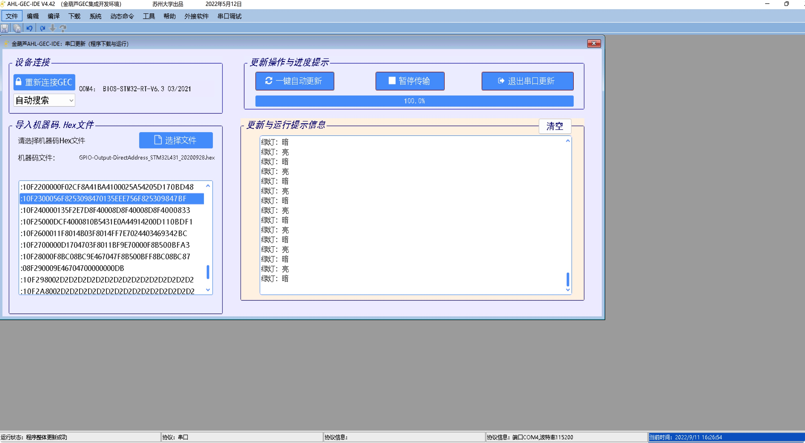
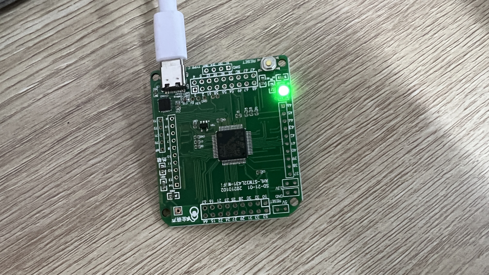
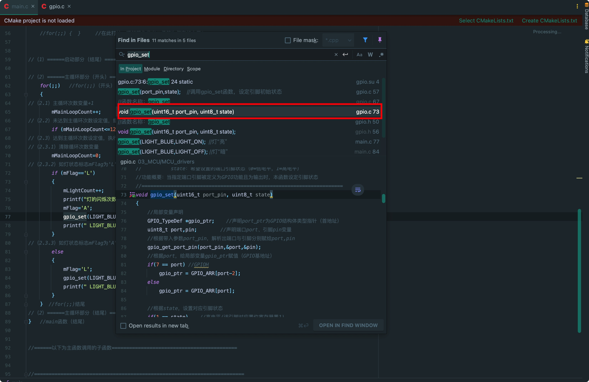
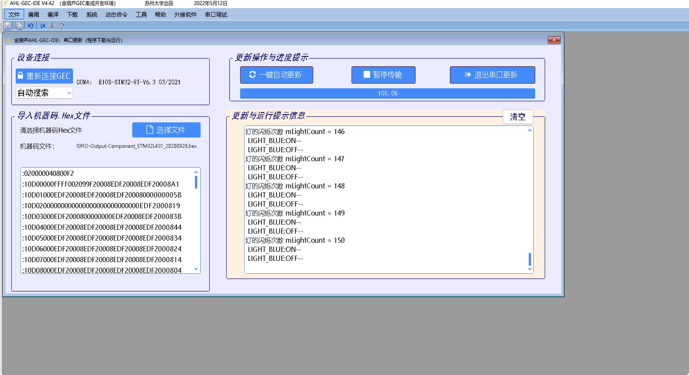

<div align='center' ><font size='70'>嵌入式学习札记</font></div>

[TOC]

# 第一次

## 基础知识与熟悉

略

## STM32L系列硬件

### 基本组成

LED三色灯，温度传感器，TTL-USB串口，触摸区，复位按钮。

### 硬件图

》，第 64 页.png)

## GPIO相关

### 概念

是输入与输出的接口，MCU通过GPIO与外界进行交互。

通常高电平（Vcc）对应数字信号1，低电平（GND）对应数字信号0。MCU使用端口寄存器来控制引脚输出1或0。MCU也可以通过端口寄存器来获取引脚的实际状态。

### 常用寄存器

|  寄存器名   | 功能  |
|  :----:  | :----:  |
|模式寄存器（GPIOx_MODER）|配置引脚功能模式 |
|输出数据寄存器（GPIOx_ODR）|读取输出引脚电平 |
|复位寄存器（GPIOx_BRR）|复位输出引脚电平 |
|置位/复位寄存器（GPIOx_BSRR）|置位/复位输出引脚 |
|...|...|

### 软件干预硬件

常用函数：gpio_init，gpio_set，gpio_get等等。

64 引脚封装的STM32L431芯片的GPIO引脚分为5 个端口，标记为A、B、C、D，以及H，共含50个引脚。端口作为GPIO引脚时，逻辑1对应高电平，逻辑0对应着低电平。

## 实验一

### GPIO端口模式寄存器（GPIOx_MODER）

这个寄存器用于配置GPIO端口相应引脚的工作模式。工作模式一共分四种，分别为输入模式，输出模式，复用功能模式，模拟模式。

因为一个口有16个引脚，该寄存器为32位，所以每两个二进制位控制一个引脚的状态，分别对应如下表，在这里注意：和一般的编程习惯一样，它序号是从0开始的：

| 数据位 | D31~D30     | D29~D28     | …    | D3~D2      | D1~D0      |
| ------ | ----------- | ----------- | ---- | ---------- | ---------- |
| 读/写   | MODE15[1:0] | MODE14[1:0] | …    | MODE1[1:0] | MODE0[1:0] | 

### GPIO端口输出数据寄存器（GPIOx_ODR）

这个寄存器用来设置GPIO端口的输出电平。1代表高电平，0代表低电平。D31~D16位保留，若OD5=0，5号引脚为低电平；OD5=1，5号引脚为高电平。

### GPIO端口位置1/复位寄存器（GPIOx_BSRR）

这个寄存器用来置1或者清0。这个寄存器有32个位，低16位的作用是让指定的IO口置1；而高16位的作用是让指定的IO口置0。

假如GPIO_A原本的状态是1111 0000 1111 0000 ，要想让第3位置1，就可以使GPIO->BSRR=0000 0000 0000 0000 0000 0000 0000 1000，那么此时GPIOA的状态就会变成1111 0000 1111 1000，也就是说，如果想让某个位置1，只需要在BSRR把对应的那个位写1就行了，写0的位不会发生改变。置0同理，只不过在BSRR的高16位操作。

### GPIO端口复位寄存器（GPIOx_BRR）

该寄存器用于复位GPIO端口相应引脚的输出状态为低电平。

功能与BSRR寄存器的高16位相同。

### 利用输出数据寄存器（GPIOx_ODR）来更换BSRR和BRR寄存器

首先我们要定义ODR寄存器：

```c
volatile uint32_t* gpio_odr;    //GPIO位复位寄存器
```

用B口ODR寄存器的绝对地址0x48000414减去B口基址0x48000400得到0x14，转换为十进制后得到20，因为4个字节一个单元，20/4得到偏移量为5。

```c
gpio_odr=gpio_ptr+5;
```

因为绿灯在B口8引脚处，根据GPIOx_MODER寄存器的工作范围来看，需要将该寄存器的16，17位变为01，就可以控制该引脚为低电平，绿灯闪烁。

控制某位为0可以用0与其做“与”运算，反之为1就用1与其做“或运算”。

所以编写如下代码即可：

```c
*gpio_mode &= ~(1<<17);  
*gpio_mode |=(1<<16);  
```

最后一步需要改变ODR寄存器的值来控制GPIO相应引脚的输出电平，因为绿灯在B口8引脚处，所以要控制8引脚为0输出低电平使灯亮，反之同理，类比上面的步骤编写代码：

```c
if (mFlag=='A')   //若灯状态标志为'A'
{
  *gpio_odr&=~(1<<8);     //设置灯“亮”
  printf("绿灯：亮\r\n");  //通过调试串口输出灯的状态
  mFlag='L';             //改变状态标志
}
else                   //否则,若灯状态标志不为'A'    
{
  *gpio_odr|=(1<<8);     //设置灯“暗”
  printf("绿灯：暗\r\n");   //通过调试串口输出灯的状态
  mFlag='A';              //改变状态标志
}	
```

### 最终代码

```c
#define GLOBLE_VAR
#include "includes.h"      //包含总头文件

//----------------------------------------------------------------------
//声明使用到的内部函数
//main.c使用的内部函数声明处

//----------------------------------------------------------------------
//主函数，一般情况下可以认为程序从此开始运行（实际上有启动过程见书稿）
int main(void)
{
  //（1）======启动部分（开头）==========================================
  //（1.1）声明main函数使用的局部变量
  uint32_t mMainLoopCount;  //主循环使用的记录主循环次数变量
  uint8_t  mFlag;            //主循环使用的临时变量

  //（1.2）【不变】关总中断
  DISABLE_INTERRUPTS;


  //（1.3）给主函数使用的局部变量赋初值
  mMainLoopCount = 0;     //主循环使用的记录主循环次数变量
  mFlag='A';              //主循环使用的临时变量：蓝灯状态标志
  volatile uint32_t* RCC_AHB2;    //GPIO的B口时钟使能寄存器地址
  volatile uint32_t* gpio_ptr;    //GPIO的B口基地址
  volatile uint32_t* gpio_mode;   //引脚模式寄存器地址=口基地址
  volatile uint32_t* gpio_bsrr;   //置位/复位寄存器地址
  volatile uint32_t* gpio_brr;    //GPIO位复位寄存器
  volatile uint32_t* gpio_odr;    //GPIO位复位寄存器
  //（1.5.2）变量赋值
  RCC_AHB2=(uint32_t*)0x4002104C;   //GPIO的B口时钟使能寄存器地址
  gpio_ptr=(uint32_t*)0x48000400;   //GPIO的B口基地址
  gpio_mode=gpio_ptr;    //引脚模式寄存器地址=口基地址
  //	gpio_mode=0b00000000000000000000000000000000;
  gpio_bsrr=gpio_ptr+6;  //置位/复位寄存器地址
  gpio_brr=gpio_ptr+10;  //GPIO位复位寄存器
  //  gpio_odr=(uint32_t*)0x48000414;
  gpio_odr=gpio_ptr+5;
  *RCC_AHB2|=(1<<1);       //GPIOB的B口时钟使能
  //（1.5.3.1）定义B口9脚为输出引脚（令D19、D18=01)方法如下：
  *gpio_mode &= ~(1<<17);  //0b11111111111100111111111111111111;
  *gpio_mode |=(1<<16);    //0b00000000000001000000000000000000;

  ENABLE_INTERRUPTS;

  for(;;)     //for(;;)（开头）
  {

    //（2.1）主循环次数+1，并判断是否小于特定常数
    mMainLoopCount++;                         //+1
    if (mMainLoopCount<=6556677)  continue;   //如果小于特定常数，继续循环
    //（2.2）主循环次数超过特定常数，灯状态进行切换（这样灯会闪烁）
    mMainLoopCount=0;      //清主循环次数
    //切换灯状态
    if (mFlag=='A')   //若灯状态标志为'A'
    {
      *gpio_odr&=~(1<<8);     //设置灯“亮”
      printf("绿灯：亮\r\n");  //通过调试串口输出灯的状态
      mFlag='L';             //改变状态标志
    }
    else                   //否则,若灯状态标志不为'A'    
    {
      *gpio_odr|=(1<<8);     //设置灯“暗”
      printf("绿灯：暗\r\n");   //通过调试串口输出灯的状态
      mFlag='A';              //改变状态标志
    }	
  }     //for(;;)结尾
  //（2）======主循环部分（结尾）========================================
}
```

### 实验截图





## 实验二

### GPIO常用函数

| 序号 | 函数名           | 简明功能        | 描述                                                         |
| ---- | ---------------- | --------------- | ------------------------------------------------------------ |
| 1    | gpio_init        | 初始化          | 引脚复用为GPIO功能；定义其为输入或输出；若为输 出，还给出其初始状态 |
| 2    | gpio_set         | 设定引脚状态    | 在GPIO输出情况下，设定引脚状态（高/低电平）                  |
| 3    | gpio_get         | 获取引脚状态    | 在GPIO输入情况下，获取引脚状态（1/0）                        |
| 4    | gpio_reverse     | 反转引脚状态    | 在GPIO输出情况下，反转引脚状态                               |
| 5    | gpio_pull        | 设置引脚上/下拉 | 当GPIO输入情况下，设置引脚上/下拉                            |
| 6    | gpio_enable_int  | 使能中断        | 当GPIO输入情况下，使能引脚中断                               |
| 7    | gpio_disable_int | 关闭中断        | 当GPIO输入情况下，关闭引脚中断                               |
### 使用gpio_reverse来替换gpio_set

那就首先跟进一下代码，看看gpio_set是怎么定义的：



是在gpio.c的第73行中：

```c
void gpio_set(uint16_t port_pin, uint8_t state)
{
	//局部变量声明
	GPIO_TypeDef *gpio_ptr;    //声明port_ptr为GPIO结构体类型指针（首地址）
	uint8_t port,pin;        //声明端口port、引脚pin变量
	//根据带入参数port_pin，解析出端口与引脚分别赋给port,pin
	gpio_get_port_pin(port_pin,&port,&pin);
	//根据port，给局部变量gpio_ptr赋值（GPIO基地址）
	if(7 == port) //GPIOH
		gpio_ptr = GPIO_ARR[port-2];
	else
		gpio_ptr = GPIO_ARR[port];

	//根据state，设置对应引脚状态
	if(1 == state)    //高电平(该引脚对应置位寄存器置1)
		gpio_ptr->BSRR = (uint32_t)(1u<<pin);
	else              //低电平(该引脚对应重置寄存器置1)
		gpio_ptr->BRR = (uint32_t)(1u<<pin);
}
```

可以看到该函数接受两个值，第一个引脚pin，第二个是引脚的状态。大意就是高电平（1）就把BSRR寄存器相应的位置1，反之亦然。

再看看gpio_reverse函数：

```c
void gpio_reverse(uint16_t port_pin)
{
	//局部变量声明
	GPIO_TypeDef *gpio_ptr;    //声明port_ptr为GPIO结构体类型指针（首地址）
	uint8_t port,pin;        //声明端口port、引脚pin变量
	//根据带入参数port_pin，解析出端口与引脚分别赋给port,pin
	gpio_get_port_pin(port_pin,&port,&pin);
	//根据port，给局部变量gpio_ptr赋值（GPIO基地址）
	if(7 == port) //GPIOH
		gpio_ptr = GPIO_ARR[port-2];
	else
		gpio_ptr = GPIO_ARR[port];

    //判断引脚输出状态
	if ((gpio_ptr->ODR & (1u<<pin)) != 0x00u)
		//高电平，则反转为低电平
		gpio_ptr->BRR = (uint32_t)(1u<<pin);
	else
		//低电平，则反转为高电平
		gpio_ptr->BSRR = (uint32_t)(1u<<pin);
}
```

可以看到就是使用ODR寄存器来判断电平状态，如果高电平，就反转。所以在这里其实使用gpio_set或者gpio_reverse并没有区别，因为gpio_reverse函数中就执行的set的操作。只要更改代码就行了。

### 最终代码

```c

int main(void)
{
//（1）======启动部分（开头）==========================================
//（1.1）声明main函数使用的局部变量
	uint32_t mMainLoopCount;  //主循环次数变量
	uint8_t  mFlag;           //灯的状态标志
	uint32_t mLightCount;     //灯的状态切换次数

//（1.2）【不变】关总中断
	DISABLE_INTERRUPTS;

//（1.3）给主函数使用的局部变量赋初值
    mMainLoopCount=0;    //主循环次数变量
	mFlag='A';           //灯的状态标志
	mLightCount=0;       //灯的闪烁次数

//（1.4）给全局变量赋初值
   
//（1.5）用户外设模块初始化
	gpio_init(LIGHT_BLUE,GPIO_OUTPUT,LIGHT_ON);	//初始化蓝灯
	


	ENABLE_INTERRUPTS;
	
	printf("------------------------------------------------------\n");   
    printf("金葫芦提示：构件法输出控制小灯亮暗   \n");
    printf("    第一次用构件方法点亮的蓝色发光二极管，\n");
    printf("    这是进行应用编程的第一步，可以在此基础上，\n");
    printf("   “照葫芦画瓢”地继续学习实践。\n");
    printf("    例如：改为绿灯；调整闪烁频率等。\n");
    printf("------------------------------------------------------\n"); 
    
    //asm ("bl .");
    
    //for(;;) {  }     //在此打桩，理解蓝色发光二极管为何亮起来了？
    
        
//（1）======启动部分（结尾）==========================================

//（2）======主循环部分（开头）========================================
	for(;;)   //for(;;)（开头）
	{
//（2.1）主循环次数变量+1
        mMainLoopCount++;
//（2.2）未达到主循环次数设定值，继续循环
		if (mMainLoopCount<=12888999)  continue;
//（2.3）达到主循环次数设定值，执行下列语句，进行灯的亮暗处理
//（2.3.1）清除循环次数变量
		mMainLoopCount=0; 
//（2.3.2）如灯状态标志mFlag为'L'，灯的闪烁次数+1并显示，改变灯状态及标志
		if (mFlag=='L')                    //判断灯的状态标志
		{
			mLightCount++;  
			printf("灯的闪烁次数 mLightCount = %d\n",mLightCount);
			mFlag='A';                       //灯的状态标志
            gpio_reverse(LIGHT_BLUE);
		//	gpio_set(LIGHT_BLUE,LIGHT_ON);  //灯“亮”
			printf(" LIGHT_BLUE:ON--\n");   //串口输出灯的状态
		}
//（2.3.3）如灯状态标志mFlag为'A'，改变灯状态及标志
		else
		{
			mFlag='L';                       //灯的状态标志
            gpio_reverse(LIGHT_BLUE);
	//		gpio_set(LIGHT_BLUE,LIGHT_OFF); //灯“暗”
			printf(" LIGHT_BLUE:OFF--\n");  //串口输出灯的状态
		}
	}  //for(;;)结尾
//（2）======主循环部分（结尾）========================================
}   //main函数（结尾）

```

### 实验截图


